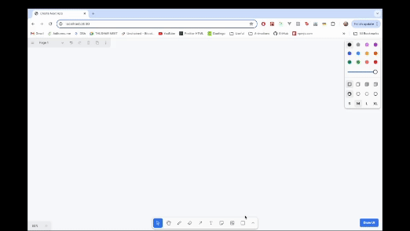

# sketch-a-ui

This is an app that uses tldraw and the gemini-vision-pro api to generate html based on a wireframe you draw.



This works by just taking the current canvas SVG, converting it to a PNG, and sending that png to gemini-vision-pro with instructions to return a single html file with tailwind.

## Getting Started

This is a Next.js app. To get started run the following commands in the root directory of the project. You will need an GEMINI API key with access to the GEMINI Vision API.

> Note this uses Next.js 14 and requires a version of `node` greater than 18.17. [Read more here](https://nextjs.org/docs/pages/building-your-application/upgrading/version-14).

```bash
echo "GEMINI_API_KEY=your-api-key" > .env.local
npm install
npm run dev
```

Open [http://localhost:3000](http://localhost:3000) with your browser to see the result.
